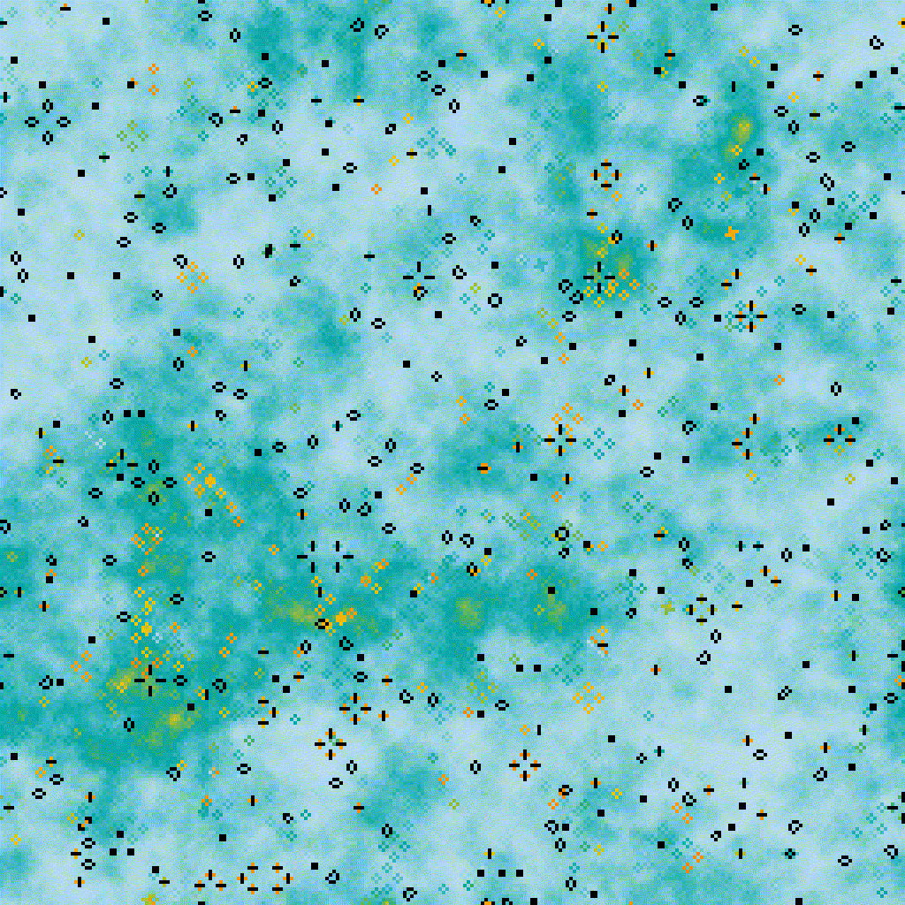
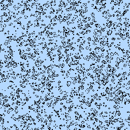
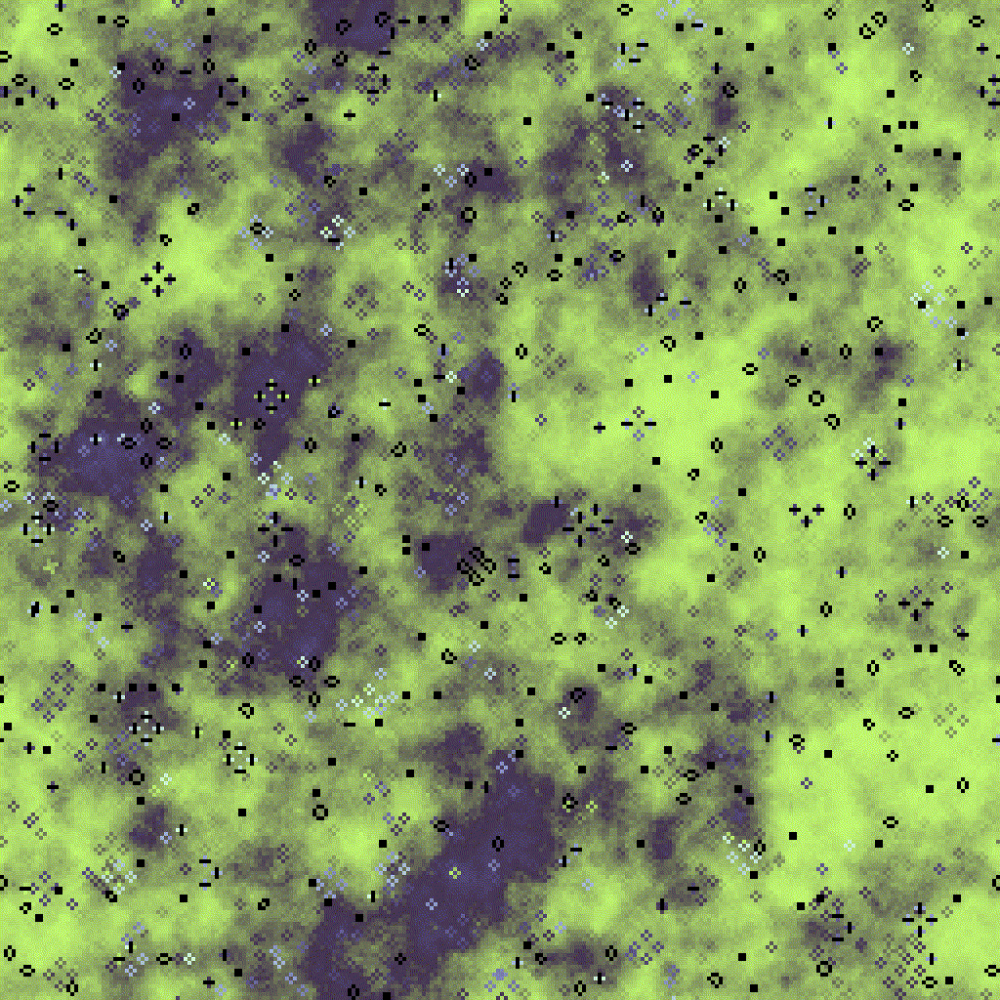
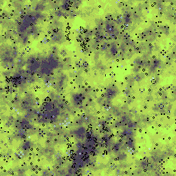
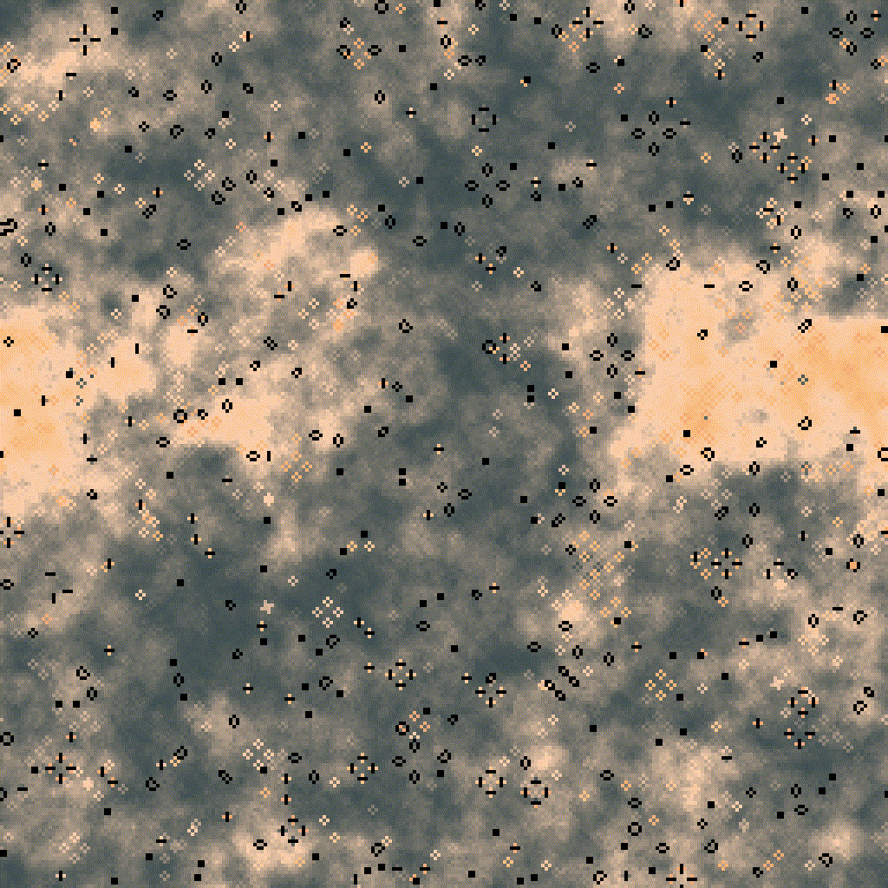
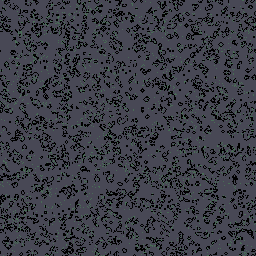

# nuunamnir.john-conway
## Description
A shader-based implementation of John Horton Conway\'s game of life, a cellular automaton devised in 1970. The "game" simulates the life of cells on a grid. Cells are birthed or die depending on the state of its neighbors. A live cell is visualized by a black rectangle, a dead cell is colored based on the number of deaths that occurred on it.
## Installation and Requirements
Make sure to have a Python interpreter installed. Then, just clone this repository and get the dependencies via pip.
```
cd nuunamnir.john-conway
pip install -r requirements.txt
```
## Usage
Run the script with the `--help` argument to get a list of possible arguments. To start/stop recording simulations frames, press the spacebar. To reset the simulation, press enter.
```
cd src\
python simulate.py --help
```
## Examples
### Uniform Distribution
```
python simulate.py --vsync false --colormap life_00.png --distribution uniform --width 256 --height 256
```



## Normal Distribution
```
python simulate.py --vsync false --colormap life_01.png --distribution normal --width 256 --height 256
```



### Exponential Distribution
```
python simulate.py --vsync false --colormap life_02.png --distribution exponential --width 256 --height 256
```

